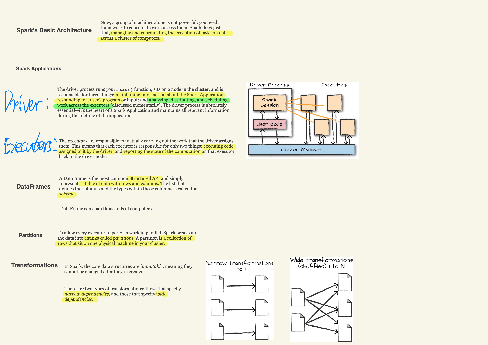
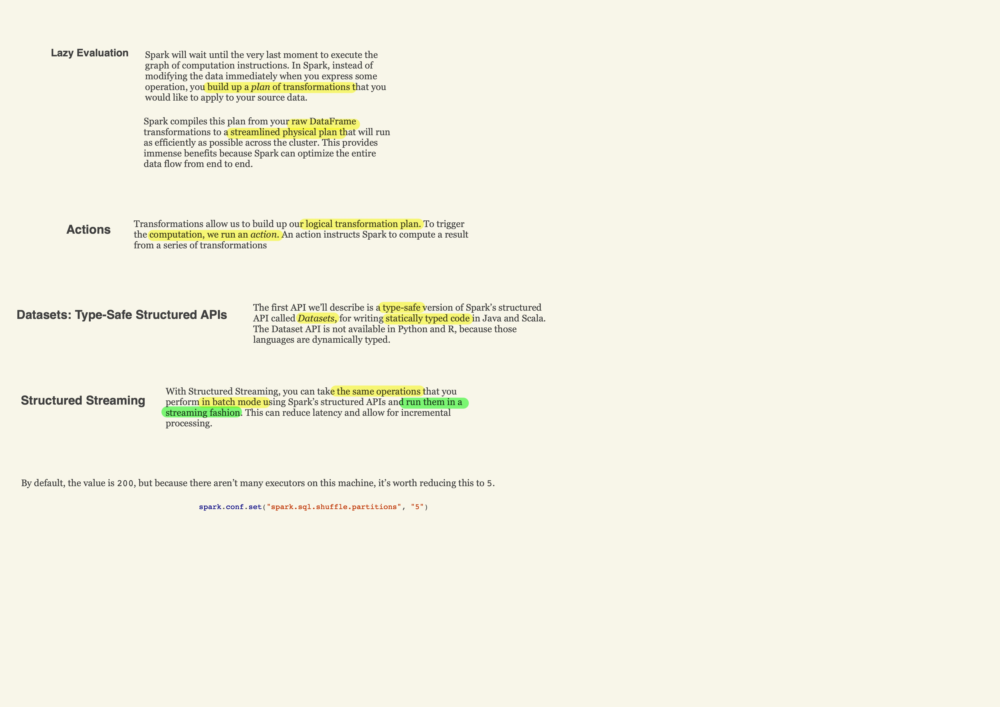
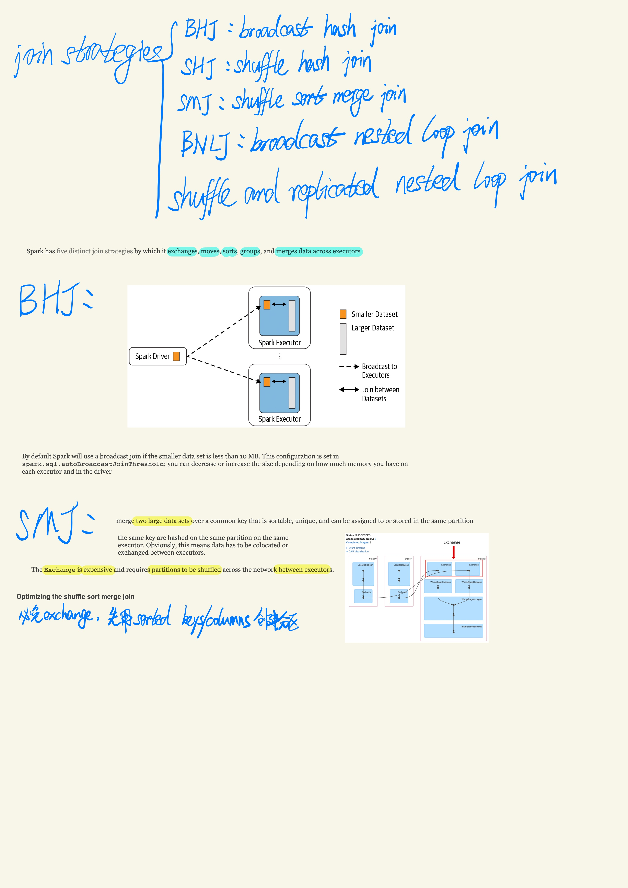

## Introduction

Introduction

## Structured Operations

Structured Operations

## Structured API

Structured API

## RDD & Distributed Shared Variables

RDD & Distributed Shared Variables

## Joins

Joins

## Memory Management

Memory Management

Links:
- [Spark 1.x introduced Project Tungsten](https://databricks.com/blog/2015/04/28/project-tungsten-bringing-spark-closer-to-bare-metal.html)
- [Spark 2.x introduced the second-generation Tungsten engine](https://databricks.com/blog/2016/05/23/apache-spark-as-a-compiler-joining-a-billion-rows-per-second-on-a-laptop.html)

## Production Application

Production Application

